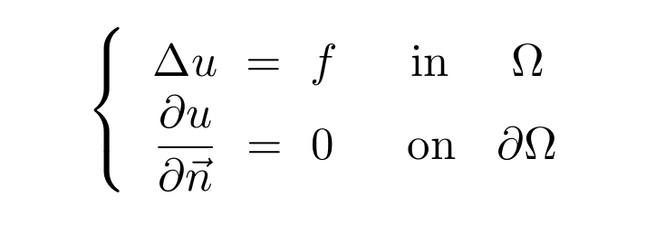

# Poisson Equation with Neumann Boundary Conditions
This problem setup consists of solving the Poisson equation with homogeneous Neumann boundary conditions on varying domains:

  

In particular, the domain `\Omega` and source term `f` are permitted to vary, and the convolutional network is trained to learn the mapping between these input terms and the target solution `u`.

