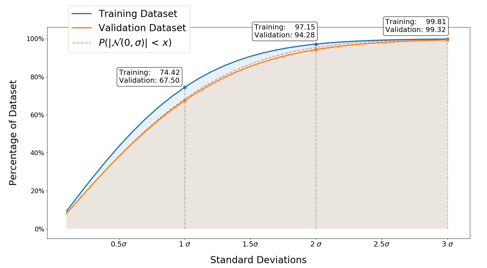
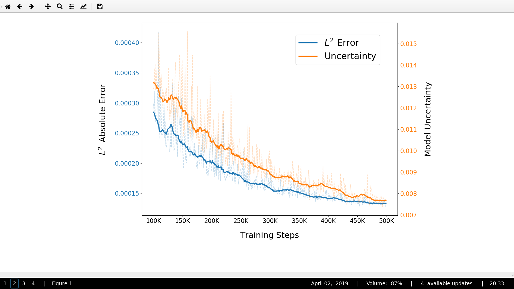
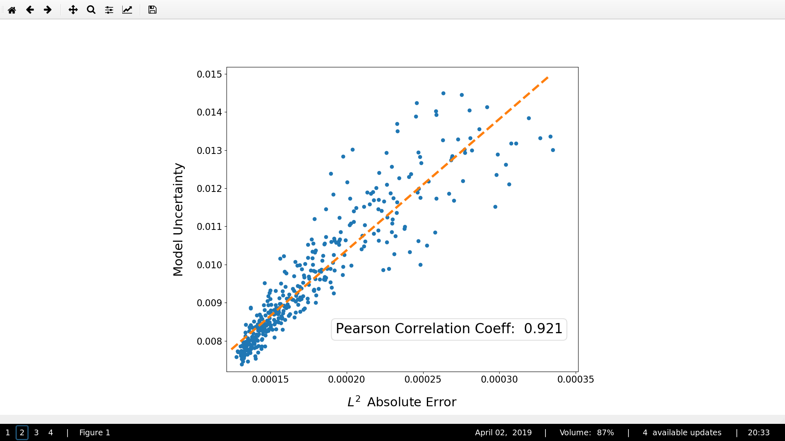
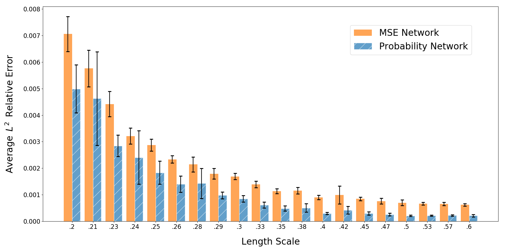

# Evaluating Trained Models

## Freezing Models
Trained models can be frozen using the utility file `Freeze.py`:

```console
$ python Freeze.py --model_dir ../Model/
```


## Plotting Predictions

```console
$ python Plot_Prediction.py --model_dir ../Model/
```

<p align="center">
  
</p>


```console
$ python Plot_Prediction.py --model_dir ../Model/ --show_error
```

<p align="center">
  
</p>


## Uncertainty Quantification Analysis

```console
$ python Compute_UQ_Bounds.py --model_dir ../Model/

$ python Plot_UQ.py
```

<p align="center">
  
</p>


## Uncertainty Levels during Training

```console
$ python Plot_Training_UQ.py --model_dir ../Model/
```

<p align="center">
  
</p>

<p align="center">
  
</p>


## Class Losses

```console
$ python Compute_Class_Losses.py --model_dir ../Model/

$ python Plot_Class_Loss.py
```

<p align="center">
  
</p>


## Analysis of Data Counts

```console
$ python main.py --model_dir Model_1-4  --data_files 4
$ python main.py --model_dir Model_1-8  --data_files 8
$ python main.py --model_dir Model_1-16 --data_files 16
$ python main.py --model_dir Model_1-32 --data_files 32
```


```console
$ python Plot_Data_Count_Comparisons.py
```

<p align="center">
  
</p>
