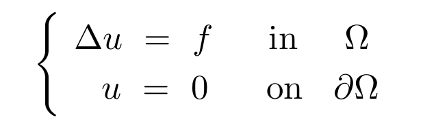

# Poisson Equation on Varying Domains
This problem setup consists of solving the Poisson equation with homogeneous Dirichlet boundary conditions on varying domains confied to a fixed, two-dimensional region:

<p align="center">
  
</p>

In particular, the domain `\Omega` and source term `f` are permitted to vary, and the convolutional network is trained to learn the mapping between these input terms and the target solution `u`.


## Generating Data
All of the files required for data generation are provided in the `Setup/` directory, and the complete dataset can be created by following the instructions outlined in the `Setup/README.md` file.


## Training Model
Once the dataset has been created, the convolutional model can be trained via:


```console
$ python main.py --model_dir Model_1 --network 1 --use_prob_loss --training_steps 100000 
```

Additional training flags can be passed as prescribed in the `flags.py` files in each problem subdirectory; default values for various training modes are provided in the `Train_Model.sh` bash file.  The models are indexed by integers and store checkpoints, logs, and configuration files in the `Model_*/` subdirectories.


Training is automatically resumed from the last checkpoint if any exist in the associated `Model_*/Checkpoints/` subdirectory; these checkpoints must be deleted before retraining any model with a modified network architecture.
However, this does allow for training to be continued/extended at any time by issuing the original `python main.py` command with an updated step count passed using the `--training_steps` flag.


#### Checking Loss on Complete Dataset
To evaluate the current training/validation losses on the complete dataset at any point during training, the training procedure can simply be interrupted using the `Ctrl` + `C` command and the original `python main.py` command can be rerun with the `--training_steps` flag set to any number less than the current step.


### TensorBoard

The training progress can be monitored using TensorBoard:

```console
$ tensorboard --logdir Model_1/logs/
```


## File Overview


##### `--- flags.py ---`
Provides training options and specifies hyperparameter values for the model.  Key flags include:
* `--training_steps` - number of training steps/iterations
* `--learning_rate` - learning rate for Adam optimizer
* `--dropout_rate` - dropout rate used to avoid overfitting
* `--use_prob_loss` - use the probabilistic loss function for training


##### `--- Train_Model.sh ---` 
**Technical Note:** 
All `*.sh` files in this repository are Bash scripts and must be made executable using `chmod +x *.sh`.


Bash script with a collection of predefined configurations available for training.  In particular, the script provides training configurations which can be executed using the `./Train_Model.sh *` command with an integer argument `*` corresponding to one of the following setups:
* `1` - Probabilistic loss
* `2` - MSE loss
* `3` - MSE loss without boundary term
* `4` - Probabilistic loss using Laplace distributions
* `5` - Probabilistic loss using Cauchy distributions


##### `--- main.py ---`
Specifies the workflow for training the neural network models and saves final evaluation scores to `Model_1/final_losses.csv`.


##### `--- base_model.py ---`
Defines all non-architecture components of the model including the network loss function, training procedure, and network evaluation metrics.


##### `--- Networks/network_1.py ---`
Defines the neural network architecture for the model.  In particular, this file provides the definitions for the `self.encoder()`, `self.decoder()`, and `self.evaluate_model()` methods used in the `base_model.py` file.


##### `--- convolutional_layers.py ---`
Provides custom wrappers for various network layers.


##### `--- utils.py ---`
Provides the data parsing function and various utilities for training.

