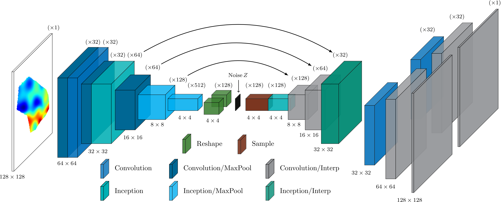
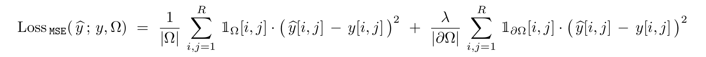
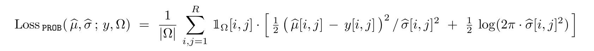
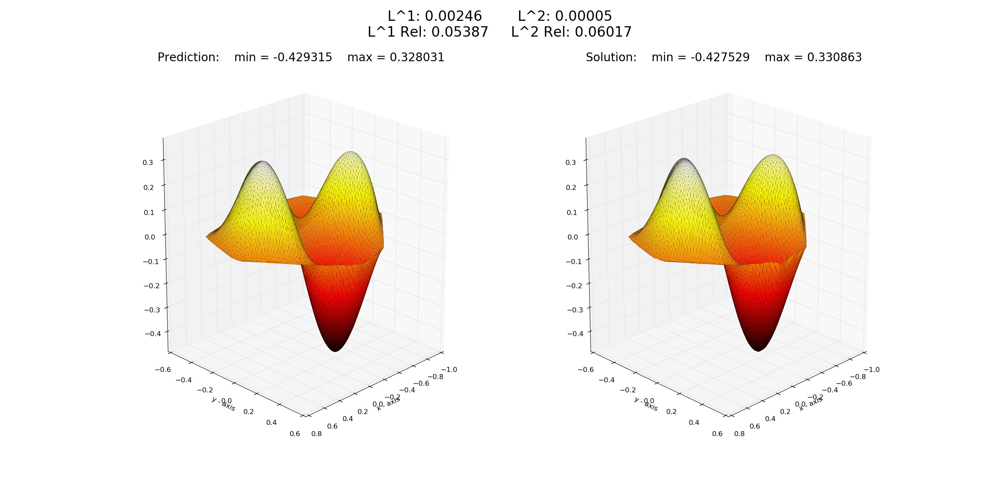
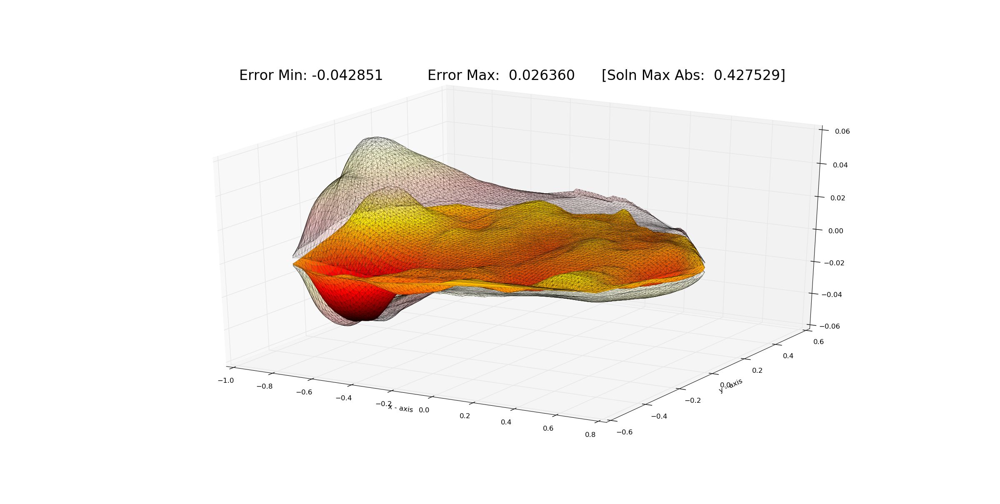
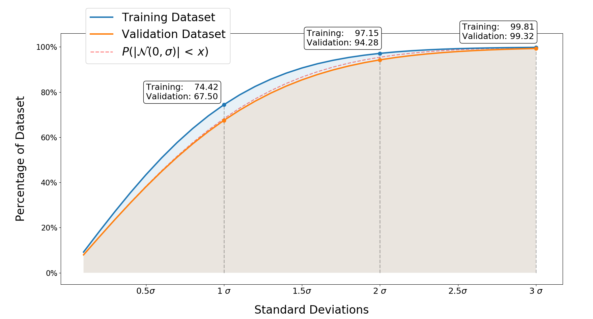

# Convolutional Solvers for PDEs
This code provides examples for training convolutional neural networks for approximating the solutions to partial differential equations.  These networks are designed to approximate solvers for complete families of differential equations, following the framework of fundamental solutions and Green's functions which provide the basis and underlying theory for the models.

### Dependencies
* [Python](https://www.python.org/) - The code is designed to work with Python 2.7 and Python 3.5 or greater.
* [TensorFlow](https://www.tensorflow.org/) - Software library used to implement the deep convolutional neural network in Python [[Installation]](https://www.tensorflow.org/install/).
* [FEniCS](https://fenicsproject.org/) / [DOLFIN](https://bitbucket.org/fenics-project/dolfin) - Finite element solver used to generate numerical solutions to PDEs [[Installation]](https://fenicsproject.org/download/).
* [NumPy](http://www.numpy.org/) - Arrays are processed in NumPy prior to being fed as tensors into TensorFlow.
* [SciPy](https://www.scipy.org/) - The data generation component requires SciPy to generate random variables from specialized distributions.
* [Matplotlib](https://matplotlib.org/) - Python package used to plot predictions and compare results with true solutions.
* [Pillow / PIL](http://pillow.readthedocs.io/en/3.1.x/index.html) - Python package used to resize images and detect the edges/boundaries of discrete domains.
* [OpenCV2](https://opencv.org/) - Library used for bicubic interpolation of NumPy arrays.

### Hardware Requirements
* 16 GB of random access memory (RAM)
* 100 GB of available hard drive space for storing training data
* GPU accelerator for reasonable training times

## Dataset Creation

### Problem Setups    
Five predefined problem setups are provided for training the convolutional network:
* `Poisson_Circle/` - Poisson equation with the domain fixed as a unit circle
* `Poisson_Varying_Domain/` - Poisson equation with both the domain and source term varying
* `Nonlinear_Poisson/` - Nonlinear partial differential equation with varying domain and source term
* `Variable_Coefficient/` - Variable coefficient differential operator with varying domain, source, and stiffness
* `Neumann_BC/` - Poisson equation with Neumann boundary conditions with varying domain and source term


### Dataset Format
The datasets generated by the code provided in the `Setup/` directories for each example are organized into `mesh_*.npy`, `data_*.npy`, and `solutions_*.npy` files stored in the `Meshes/`, `Data/`, and `Solutions/` subdirectories, respectively.  The `Variable_Coefficient` problem setup generates additional `coeff_*.npy` terms which are also stored in the `Data/` subdirectory.

Each of the stored numpy arrays corresponds to a discretization of the continuous functions associated with a given PDE system and are formatted as fixed 128x128 resolution arrays.  The mesh files are encoded as integer-valued arrays with values of zero outside of the domain, values of one throughout the interior of the domain, and values of two along the boundary; these files are used to adapt the loss function to the specific domains in consideration during training.

The NumPy arrays are then preprocessed, consolidated, and stored in the TFRecord format in the `Setup/DATA/` subdirectories.  An 80/20 split of the dataset is used to create training/validation sets; the training and validation indices are stored in the `Setup/DATA/t_indices.npy` and `Setup/DATA/v_indices.npy` files, respectively.

    
### Generating Datasets
The files for dataset creation are stored in the `Setup/` subdirectories for each problem setup.  Various dataset parameters (e.g. the total number of examples to create) are available in the `Setup/setup_flags.py` files.

The predefined settings assume that 8 CPUs are available.  The Python [multiprocessing](https://docs.python.org/2/library/multiprocessing.html) package is used to parallelize the dataset creation procedures, and the CPU count can be adjusted using the `--cpu_count` flag.

    
Once these settings have been specified, the datasets can be generated by running the `Compute_Cholesky_Factors.py` and `CREATE_DATASET.sh` scripts. 


This will create four subdirectories containing the generated dataset files:
* `Cholesky/` - contains .npy files for the Cholesky factors of covariance matrices
* `Data/` - contains .xml and .npy files for source terms
* `Meshes/` - contains .xml and .npy files for meshes
* `Solutions/` - contains .npy files for solutions

along with the preprocessed dataset example written to TFRecords files in the `./DATA/` directory.

**Note:** The `Cholesky/` files can be reused for all five problem setups (e.g. using symbolic links).  


## Training Models
Once the datasets have been created, models can be trained via:


```console
$ cd Poisson_Varying_Domain/

$ python main.py
```

Additional training flags can be passed as prescribed in the `flags.py` files in each problem subdirectory; default values for various training modes are provided in the `Train_Model.sh` bash file.


The training progress can be monitored using TensorBoard:

```console
$ tensorboard --logdir Model/logs/
```

### Network Architecture
The convolutional network architectures are defined in the `Networks/network_*.py` files in each problem directory.  The default `Networks/network_1.py` architecture corresponds to an encoder-decoder network as illustrated below:

<p align="center">
  
</p>

Alternative network architectures can be defined in `Network/network_*.py` files and used during training by passing the `--network *` flag (where `*` denotes an integer value used to label the network architecture).


### Loss Functions

#### MSE Loss
The conventional mean squared error (MSE) loss function is used by default (with the loss weight `\lambda` set to `0.1`):

<p align="center">
  
</p>

The loss weight `\lambda` for the boundary term can also be modified using the `--bdry_weight` flag; in particular, specifying `--bdry_weight 0.0` will omit the boundary component of the loss calculation.

#### Probabilistic Loss
A probabilistic training procedure can be employed by using the `--use_prob_loss` flag.  This instructs the network to make both mean and standard deviation predictions and defines the loss function to be the negative log marginal likelihood (NLML) of the true solution values with respect the predicted statistics:

<p align="center">
  
</p>


    
## Model Predictions


### Freezing Models

Trained models can be frozen using the utility files in the `Evaluation/` subdirectories:

```console
$ cd Poisson_Varying_Domain/Evaluation/

$ python Freeze.py --model_dir ../Model/
```


### Plotting Predictions

Once a trained model has been frozen to a protocol buffer file, the network predictions can be compared with true solutions using the `Plot_Prediction.py` file:

```console
$ cd Poisson_Varying_Domain/Evaluation/

$ python Plot_Prediction.py --model_dir ../Model/ --ID 1
```


<p align="center">
  
</p>


The network's predictive uncertainty can also be visualized by using the `--show_error` flag:
```console
$ cd Poisson_Varying_Domain/Evaluation/

$ python Plot_Prediction.py --model_dir ../Model/ --ID 1 --show_error
```

<p align="center">
  
</p>


The error plot shows the difference between the predicted and true solution along with transparent wireframes corresponding to the positive and negative two standard deviation ranges predicted by the network.


### Evaluating Uncertainty
The predictive uncertainty can be computed and evaluated via:

```console
$ cd Poisson_Varying_Domain/Evaluation/

$ python Freeze.py --model_dir ../Model/

$ python Compute_UQ_Bounds.py --model_dir ../Model/
```

The computed uncertainty results are stored in the `UQ_Bounds.csv` file and can be visualized with `Plot_UQ.py`:

```console
$ python Plot_UQ.py 
```

<p align="center">
  
</p>

Here the cumulative number of pixels falling within a specified standard deviation of the true solution values are plotted for both the training and validation datasets.  The target cumulative distribution function (CDF) of a one-sided normal distribution is plotted as a dashed line for reference; the agreement between the normal CDF and the observed empirical results provide evidence that the uncertainty schema is correctly capturing the uncertainty in the network predictions.
