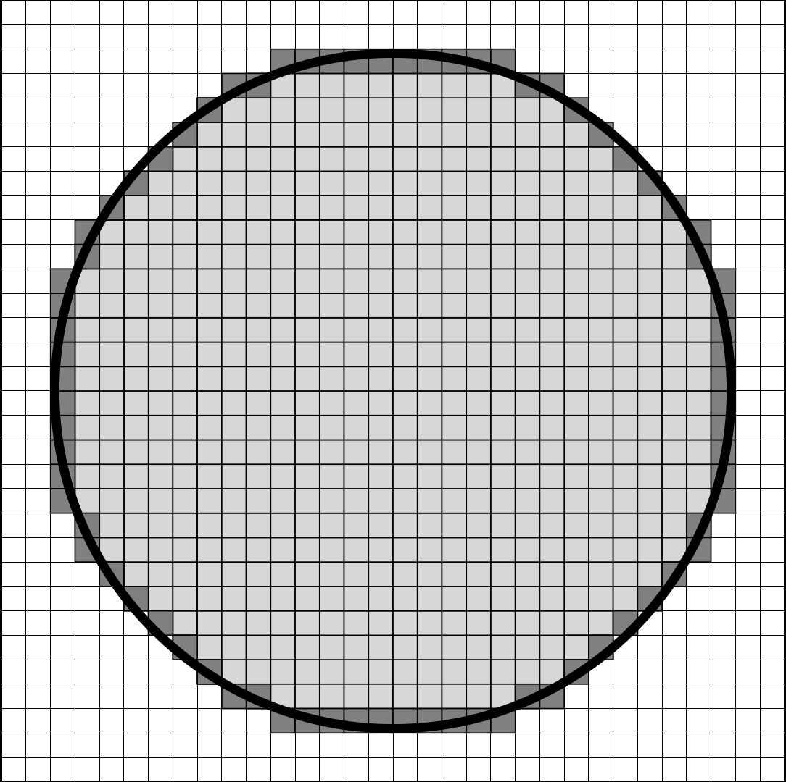
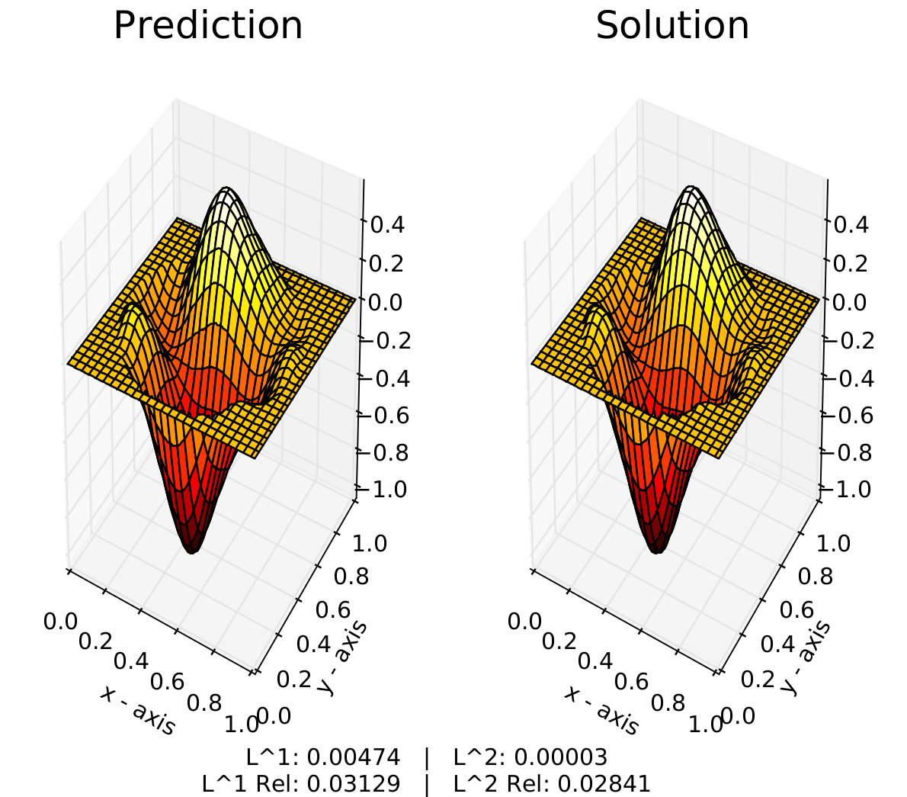

# Convolutional Network Approximations for PDEs
This code provides examples for training convolutional neural networks for approximating the solutions to partial differential equations.  These networks are designed to approximate solvers for complete families of differential equations, following the framework of fundamental solutions and Green's functions which provide the basis and underlying theory for the models.

### Dependencies
* [Python](https://www.python.org/) - The code is designed to work with Python 2.7 and Python 3.5 or greater.
* [TensorFlow](https://www.tensorflow.org/install/) - The software library used to implement the deep convolutional neural network in Python.
* [FEniCS / DOLFIN](https://bitbucket.org/fenics-project/dolfin) - The finite element solver used to generate numerical solutions to PDEs during data generation.
* [NumPy](http://www.numpy.org/) - Arrays are processed in Numpy prior to being fed as tensors into TensorFlow.
* [SciPy](https://www.scipy.org/) - The data generation component requires Scipy to generate random variables from specialized distributions.
* [Matplotlib](https://matplotlib.org/) - The Python package used to plot predictions and compare results with true solutions.
* [Pillow / PIL](http://pillow.readthedocs.io/en/3.1.x/index.html) - The Python package used to resize images and detect the edges/boundaries of discrete domains.


## Dataset Creation

### Problem Setups    
Five predefined problem setups are provided for training the convolutional network:
* `Poisson_Circle/` - Poisson equation with the domain fixed as a unit circle
* `Poisson_Varying_Domain/` - Poisson equation with both the domain and source term varying
* `Nonlinear_Poisson/` - Nonlinear partial differential equation with varying domain and source term
* `Variable_Coefficient/` - Variable coefficient elliptic differential operator
* `Neumann_BC/` - Poisson equation with Neumann boundary conditions

<p align="center">
  
</p>

    
### Generating Datasets
The files for dataset creation are stored in the `Setup/` subdirectories for each problem setup.  Various dataset parameters (e.g. the total number of examples to create) are available in the `flags.py` files.

The predefined settings assume that 4 CPUs are available.  The Python [multiprocessing](https://docs.python.org/2/library/multiprocessing.html) package is used to parallelize the dataset creation procedures, and the CPU count can be adjusted using the `--cpu_count` flag.

    
Once these settings have been specified, the datasets can be generated by running the `CREATE_DATASET.sh` shell script.  For example, the dataset for solving the Poisson equation on the unit circle can be created via:
```
$ cd Circle/
    
$ python Compute_Cholesky_Factors.py
    
 [ Generating Covariances ]
    
  Progress:  100.0%

    
$ ./CREATE_DATASET.sh
    
 [ Generating Covariances ]
    
  Progress:  100.0%

    
 [ Sampling Functions ]

  Progress:  100.0%


 [ Converting Functions ]

  Progress:  100.0%


 [ Generating Meshes ]

  Progress:  100.0%


 [ Solving Systems ]

  Progress:  100.0%


 [ Preprocessing Data ]

  Progress:  100.0%

    
 [ Writing TFRecords ]

  Progress:  100.0%
```


This will create four subdirectories containing the generated dataset files:
* `./Cholesky/` - contains .npy files for the Cholesky factors of covariance matrices
* `./Data/` - contains .xml and .npy files for source terms
* `./Meshes/` - contains .xml and .npy files for meshes
* `./Solutions/` - contains .npy files for solutions

along with the preprocessed dataset example written to TFRecords files in the `./DATA/` directory.

**Note:** The `./Cholesky/` files can be reused for all three problem setups (e.g. using symbolic links).  


## Training Models

Once the datasets have been created, models can be trained via:


```
$ cd Circle/

$ python HiRes_VAE.py --learning_rate 0.001 --z_dim 200
```

The training progress can be monitored using TensorBoard:

```
$ tensorboard --logdir Model/logs/
```

    
## Model Predictions


### Freezing Models

Trained models can be frozen using the utility files in the `Evaluate/` subdirectories:

```
$ cd Circle/Evaluate/

$ python Freeze.py --model_dir ../Model/
```


### Plotting Predictions

Once a trained model has been frozen to a protocol buffer file, the network predictions can be compared with true solutions using the `Plot_Predictions.py` file:

```
$ cd Circle/Evaluate/

$ python Plot_Prediction.py --model_dir ../Model/ --ID 1
```


<p align="center">
  
</p>

      
Multiple prediction/solution comparison plots can be saved via:

```
$ cd Circle/Evaluate/

$ python Save_Plots.py --model_dir ../Model/
```
